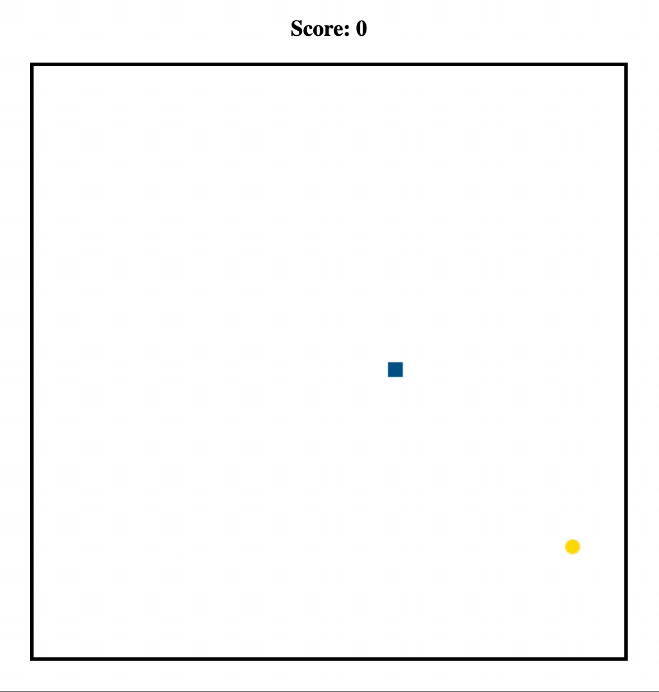

# Snake

A clone of Snake written with the Haskell library `threepenny-gui`. Supports running interactively and running a bot with a predetermined strategy.

    

## Installing and playing

1. `git clone https://github.com/brandonchinn178/snake`
1. `stack run`

You can use any of the following keys for moving the snake:
1. Arrow keys
1. IJKL
1. WASD

By default, it runs in the interactive mode. You can also run a bot with `MODE=<name of bot> stack run`. The list of available bots can be found at `src/Snake/Strategy.hs`.

More options can be found in `exe/Main.hs`.
